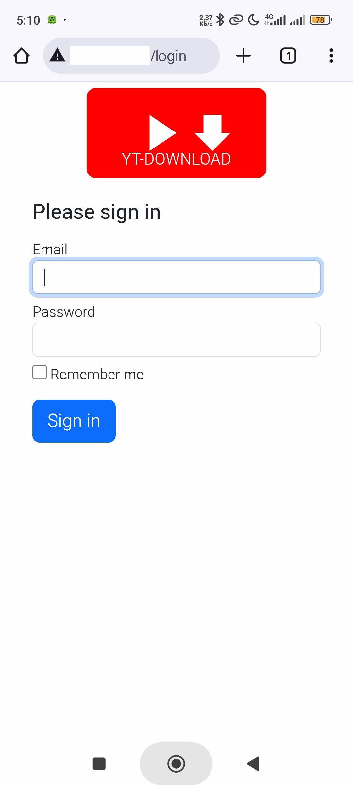
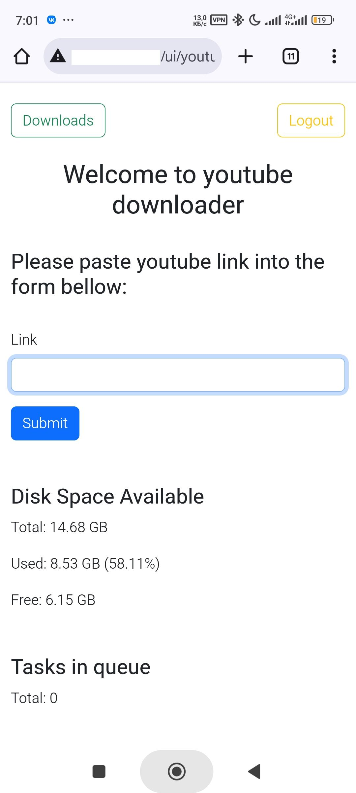
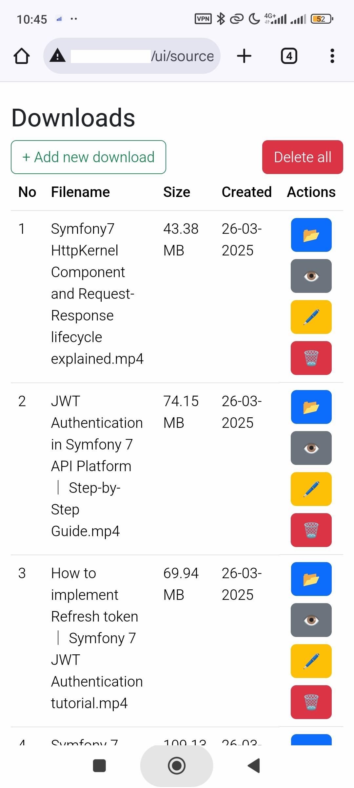

# 🎬 YouTube, Rutube, VK Video Downloader  

*A lightweight service for downloading videos from YouTube, Rutube, Instagram, Ok and Vk*  

**🛠 Tech Stack**:  
- PHP 8 🐘  
- Symfony 7 🎼 
- EasyAdmin 4 🛠️
- Docker 🐳  
- PostgreSQL 🐘  
- yt-dlp ⚡  
- norkunas/youtube-dl-php 📦  

## 📸 Preview  
    

## 🚀 Quick Start  

### ⚡ Run the Project:
1. **Environment**
   > 📝 **Note**: Create `.env.local` with DB config (host name must be `ytdownloader-pgsql`)
   ```yaml
   DATABASE_URL="postgresql://example_user_name:example_passwd12345@'ytdownloader-pgsql':5432/ytdownloader?serverVersion=16&charset=utf8"
   ```

1. **Initialize new application**:  
   ```bash
   sudo make init
   ```

2. **Restart application**:  
   ```bash
   sudo make restart
   ```

3. **Setup database (if needed)**:  
   ```bash
   sudo make db-setup
   ```

4. **Start queue worker (if needed)**:  
   ```bash
   sudo make supervisor-start
   ```

5. **Create admin by console command**:  
   ```bash
   sudo make docker-php
   php bin/console user:add <username> [password]
   ```

6. **Run tests**:  
   ```bash
   sudo make test
   ```

7. **Health check url**:  
   ```
   GET http://host.tld/health
   ```

## 📝 Todo Roadmap  

✅ ~~Background video downloads (queues)~~  
✅ ~~Download status notifications~~  
✅ ~~Playlist special characters fix~~  
✅ ~~Tests coverage~~  
✅ ~~Refactor to services~~  
✅ ~~Health check endpoint~~  
🔳 YouTube cache optimization (avoid bot detection)  
✅ ~~Download statistics counter~~  
🔳 REST API implementation  
🔳 Telegram bot integration  
✅ ~~Setup automation script~~  
✅ ~~Admin dashboard~~
