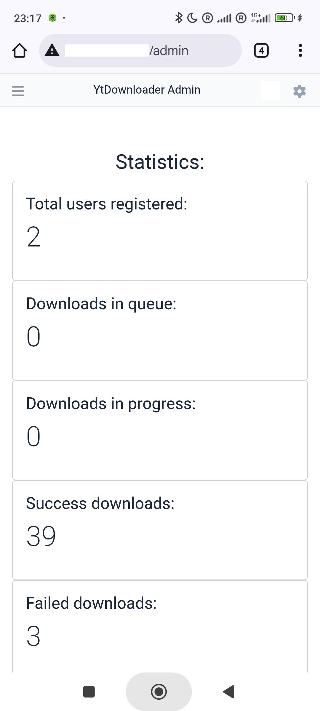

# 🎬 Download video and audio from YouTube, Instagram, Telegram, TikTok and others 

*A lightweight service for downloading video and audio from YouTube, Instagram, Telegram, TikTok and others*

**🛠 Tech Stack**:

- PHP 8 🐘
- Symfony 7 🎼
- EasyAdmin 4 🛠️
- Docker 🐳
- PostgreSQL 🐘
- Redis 🚀
- RabbitMQ 🐇
- yt-dlp ⚡
- norkunas/youtube-dl-php 📦
- botman/botman 🤖

## 📸 Preview

     

## ⚠️ Legal Disclaimer:

This program is for personal use only. Downloading copyrighted material without
permission is against YouTube's terms of services. By using this program, you
are solely responsible for any copyright violations. We are not responsible for
people who attempt to use this program in any way that breaks YouTube's terms of
services.

## 📋 Tested within:

1. 🐧 Ubuntu 22.04
2. 🐳 Docker 28.5.2
3. 📦 Docker compose v2.38.1
4. ⚙️ GNU Make 4.3

## 🚀 Quick Start

### ⚡ Run the Project:

1. **Initialize new application**:
   ```bash
   make init
   ```
   Remarks: during project init process all env files (for project and for docker) will be generated automatically, if it was not done you can generate env files by running command in bash: "make env-setup" 

2. **Restart application**:
   ```bash
   make restart
   ```

3. **Stop application**:
   ```bash
   make stop
   ```

4. **Setup database (if needed)**:
   ```bash
   make db-setup
   ```

5. **Start queue worker (if needed)**:
   ```bash
   make supervisor-start
   ```

6. **Create admin user by console command**:
   ```bash
   make docker-php
   php bin/console app:user-add <username> [password]
   ```

7. **Run tests**:
   ```bash
   make test
   ```

8. **List of all available 'make' commands**:
    ```bash
    make help
    ```

9. **Health check url**:
    ```
    GET http://host.tld/health-check
    ```
10. **Admin dashboard**:
    ```
    GET http://host.tld/admin
    ```

## 🤖 Telegram bot
1. **Init**:
    - add enable true for telegram bot in .env.local file (TELEGRAM_BOT_ENABLED=true)
    - add your bot token to .env.local file (TELEGRAM_BOT_TOKEN=change_me_please)
    - add telegram host url to .env.local file (TELEGRAM_HOST_URL=https://host.tld)
    - run the command to setup webhook:
    ```bash
   make telegram-bot-hook
    ```
    - or for unhook telegram bot run command:
    ```bash
   make telegram-bot-unhook
    ```
2. **Telegram bot commands**:
    ```
   /start - start bot
    ```

## 🔐 REST API v1 (JWT)

All API endpoints are prefixed with `/api/v1` and require a Bearer token, except the login endpoint.

### 1) Login (get JWT token)

**Request**
```
POST /api/v1/auth/login
Content-Type: application/json

{
   "email": "admin@admin.local",
   "password": "admin123456"
}
```

**Response**
```
{
   "token": "<jwt>"
}
```

### 2) Authenticated requests

Add the JWT token to the `Authorization` header:
```
Authorization: Bearer <jwt>
```

### 3) Get current user

```
GET /api/v1/auth/me
Authorization: Bearer <jwt>
```

### 4) Logout (client-side)

JWT is stateless, so logout just tells the client to discard the token:
```
POST /api/v1/auth/logout
Authorization: Bearer <jwt>
```

### 5) Add new download

```
POST /api/v1/download/create
Authorization: Bearer <jwt>
Content-Type: application/json

{
   "url": "https://example.com",
   "quality": "best"  // best|moderate|poor|audio
}
```

### 6) List downloaded files

```
GET /api/v1/source?order=desc
Authorization: Bearer <jwt>
```

### 7) Download file by id

```
GET /api/v1/source/{id}/download
Authorization: Bearer <jwt>
```

### 8) Delete file by id

```
DELETE /api/v1/source/{id}
Authorization: Bearer <jwt>
```

## 🔐 REST API v2 (JWT + Refresh token)

All API endpoints are prefixed with `/api/v2`. The login endpoint returns a JWT plus a refresh token. Use the JWT for authenticated requests. When the JWT expires, call refresh to get a new pair.

### 1) Login (get JWT + refresh token)

**Request**
```
POST /api/v2/auth/login
Content-Type: application/json

{
   "email": "admin@admin.local",
   "password": "admin123456"
}
```

**Response**
```
{
   "token": "<jwt>",
   "refresh_token": "<refresh_token>",
   "refresh_token_expires_at": "2026-01-31T12:00:00+00:00"
}
```

### 2) Authenticated requests

Add the JWT token to the `Authorization` header:
```
Authorization: Bearer <jwt>
```

### 3) Refresh tokens

**Request**
```
POST /api/v2/auth/refresh
Content-Type: application/json

{
   "refresh_token": "<refresh_token>"
}
```

**Response**
```
{
   "token": "<jwt>",
   "refresh_token": "<refresh_token>",
   "refresh_token_expires_at": "2026-01-31T12:00:00+00:00"
}
```

### 4) Get current user

```
GET /api/v2/auth/me
Authorization: Bearer <jwt>
```

### 5) Logout

```
POST /api/v2/auth/logout
Authorization: Bearer <jwt>
```

### 6) Add new download

```
POST /api/v2/download/create
Authorization: Bearer <jwt>
Content-Type: application/json

{
   "url": "https://example.com",
   "quality": "best"  // best|moderate|poor|audio
}
```

### 7) List downloaded files

```
GET /api/v2/source?order=desc
Authorization: Bearer <jwt>
```

### 8) Download file by id

```
GET /api/v2/source/{id}/download
Authorization: Bearer <jwt>
```

### 9) Delete file by id

```
DELETE /api/v2/source/{id}
Authorization: Bearer <jwt>
```

## 📝 Todo Roadmap

✅ ~~Background video downloads (queues)~~  
✅ ~~Download status notifications~~  
✅ ~~Playlist special characters fix~~  
✅ ~~Tests coverage~~  
✅ ~~Refactor to services~~  
✅ ~~Health check endpoint~~  
✅ ~~YouTube cache/cookies optimization (avoid anti-bot detection)~~  
✅ ~~Download statistics counter~~  
✅ ~~REST API implementation~~  
✅ ~~Telegram bot integration~~  
✅ ~~Setup automation script~~  
✅ ~~Admin dashboard~~  
